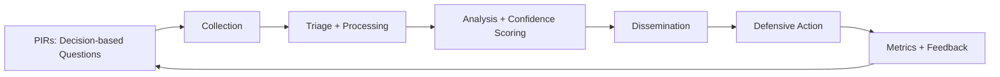

# CTI: Engineering the Discovery → Decision Loop

In modern security operations, the bottleneck isn't data volume; it's the **latency between discovery and decision.** Signals arrive fast, but prioritization, confidence, and operational follow-through lag.

This repository documents a structured framework for turning messy signals into defensible actions, moving beyond "reporting" toward "intelligence engineering."

## 🏗️ Framework Pillars
* **Requirements-Driven (PIRs):** Focus collection on questions that change business outcomes.
* **Technique-Level Mapping:** Using MITRE ATT&CK® to identify telemetry gaps, not just labeling threats.
* **Indicator Durability:** Implementing the Pyramid of Pain to move from brittle IOCs to expensive TTPs.
* **Perishable Logic:** Automated expiry and scoring to prevent "blocklist bloat."

## 📁 Repository Structure
1. [Lifecycle + PIRs](notes/01-lifecycle-and-pirs.md) - Requirements that prevent ad-hoc drift.
2. [Intel Types + Products](notes/02-intel-types-and-products.md) - Zoom levels for different stakeholders.
3. [ATT&CK Mapping](notes/03-attck-mapping.md) - Turning observations into validated coverage.
4. [Pyramid of Pain](notes/04-pyramid-of-pain.md) - Aiming for maximum adversary cost.
5. [IOC Pipeline](notes/05-ioc-pipeline.md) - Normalization, scoring, and expiry.
6. [Governance & Metrics](notes/06-governance-metrics-maturity.md) - Measuring impact, not volume.
7. [Sharing Standards](notes/07-sharing-stix-taxii.md) - Automation via STIX/TAXII.
8. [Case Study](notes/08-case-study-lateral-movement.md) - Practical application: Phishing to Lateral Movement.

## 🔄 The Loop

## 🛠️ How to use this Repo

* **For SOC Managers:** Use `notes/01` to audit your current intelligence requirements.
* **For Detection Engineers:** Use `notes/03` and `notes/05` to build your enrichment and validation pipelines.
* **For Analysts:** Use the "Senior Fix" boxes at the bottom of each page to avoid common reporting pitfalls.
