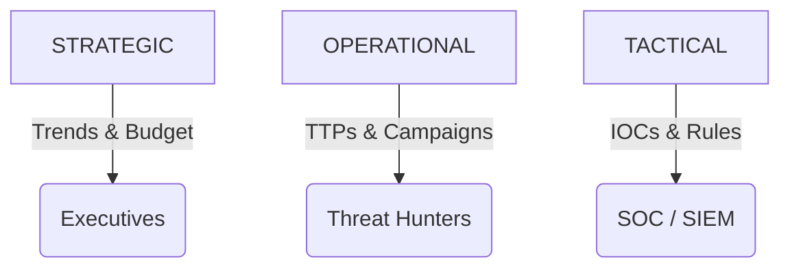

### File 2: `notes/02-intel-types-and-products.md`
*(Focus: Who gets what?)*

# 02 — Intel Types + Products

## 🧠 The Zoom Levels
You cannot send a malware hash to a CISO, and you cannot send a geo-political PDF to a Firewall.



## 🔑 Keywords

**Strategic** (Executive), **Operational** (Campaigns), **Tactical** (TTPs), **Technical** (Artifacts).

## 📝 Product Cheat Sheet

| Level | Audience | The Product | The Goal |
| --- | --- | --- | --- |
| **Strategic** | CISO / Board | Landscape Report | Investment decisions. |
| **Operational** | Hunters / IR | Threat Profile | Understanding attacker intent. |
| **Technical** | SOC / Firewall | IOC Feed | Blocking & Detection. |

### ⚠️ Anti-Pattern → 🔧 The Fix

**Anti-Pattern:** Spamming the CISO with technical "Actionable Intelligence" newsletters.
**The Fix:** Filter by persona. If they can't configure a firewall, don't send them an IP address.
**Evidence:** A specific distribution list for each intel type.

```
