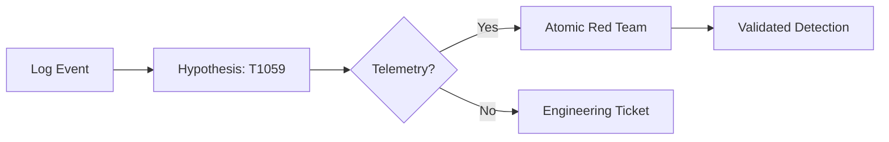

### File 3: `notes/03-attck-mapping.md`
*(Focus: Validation, not just labeling)*

# 03 — ATT&CK Mapping & Validation

## 🧠 The Validation Pipeline
Don't just tag it. Test it.



## 🔑 Keywords

**TTP Mapping**, **Telemetry Gap**, **Atomic Testing**, **Detection Engineering**.

## 📝 How to Map (Realistically)

1. **Don't** map every technique in the report.
2. **Do** map the "Choke Points" (techniques the attacker *must* use).
* *Example:* They can change their malware hash, but they *must* execute code (T1059) and they *must* move laterally (T1021).

---

### ⚠️ Anti-Pattern → 🔧 The Fix

**Anti-Pattern:** "Coloring in the map" (Claiming we block T1059 because we have one rule for it).
**The Fix:** **Atomic Validation**. Run the actual attack command in a test environment. Did it fire?
**Evidence:** A validation log: `Test ID` -> `Expected Log` -> `Actual Log`.

```
