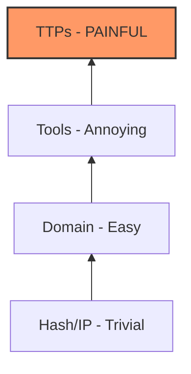

### File 4: `notes/04-pyramid-of-pain.md`
*(Focus: Inflicting cost on the adversary)*

# 04 — The Pyramid of Pain

## 🧠 The Hierarchy
The higher you go, the harder you make it for them.



## 🔑 Keywords

**Adversary Cost**, **Durability**, **Behavioral Analysis**, **Static Indicators**.

## 📝 The Strategy

* **Bottom (Hash/IP):** Automate this. Machines should block these, humans shouldn't touch them.
* **Top (TTPs):** Focus here. If you detect "PowerShell downloading a file," you catch them even if they change the IP 100 times.

---

### ⚠️ Anti-Pattern → 🔧 The Fix

**Anti-Pattern:** Measuring success by "Number of IPs blocked." (Whack-a-mole).
**The Fix:** Measuring success by **TTP Coverage**. "Can we detect the behavior, regardless of the tool?"
**Evidence:** Detection rules mapped to behaviors, not just static lists.

```
