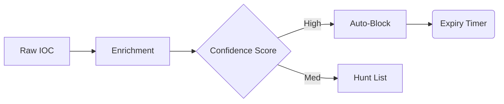

### File 5: `notes/05-ioc-pipeline.md`
*(Focus: Engineering entropy)*

# 05 — IOC Pipeline (Engineering)

## 🧠 The Lifecycle of an Indicator
Indicators rot. If you don't expire them, you break the network.

## 🔑 Keywords

**Normalization**, **Enrichment**, **Confidence Scoring**, **TTL (Time to Live)**.

## 📝 The "Must-Have" Fields

Every indicator in the database needs:

1. **Context:** *Why* is it bad? (e.g., "C2 Server for Emotet").
2. **Confidence:** 0-100 score.
3. **Expiry:** The exact date/time this rule dies.

---

### ⚠️ Anti-Pattern → 🔧 The Fix

**Anti-Pattern:** "Forever Blocklists." (Firewall rules from 2019 that nobody understands).
**The Fix:** **Automated Decay**. IPs expire in 7 days. Domains in 30. Hashes in 365.
**Evidence:** A dashboard showing "Active vs. Expired" indicators.
