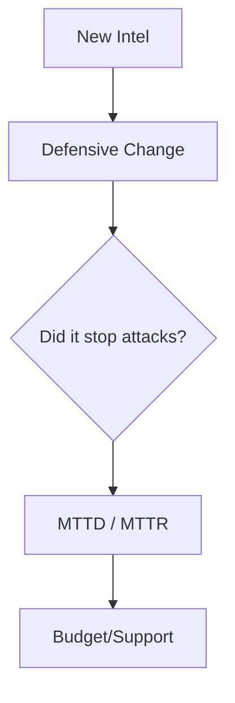

### File 6: `notes/06-governance-metrics-maturity.md`
*(Focus: Prove it works)*

# 06 — Governance & Metrics

## 🧠 The Feedback Loop
Metrics should answer: "Are we faster? Are we smarter?"

## 🔑 Keywords

**MTTD** (Mean Time to Detect), **False Positive Rate**, **Decision Latency**, **ROI**.

## 📝 Metrics that Matter

* **Bad Metric:** "Number of reports written." (Activity, not value).
* **Good Metric:** "Percentage of alerts that led to a true positive." (Signal quality).
* **Best Metric:** "Decision Latency" (Time from 'Intel Received' to 'Defenses Updated').

---

### ⚠️ Anti-Pattern → 🔧 The Fix

**Anti-Pattern:** Vanity Metrics. "We ingested 5 million indicators!"
**The Fix:** Outcome Metrics. "We reduced phishing click rates by 20% using this intel."
**Evidence:** A monthly report that focuses on *saves*, not *volume*.
