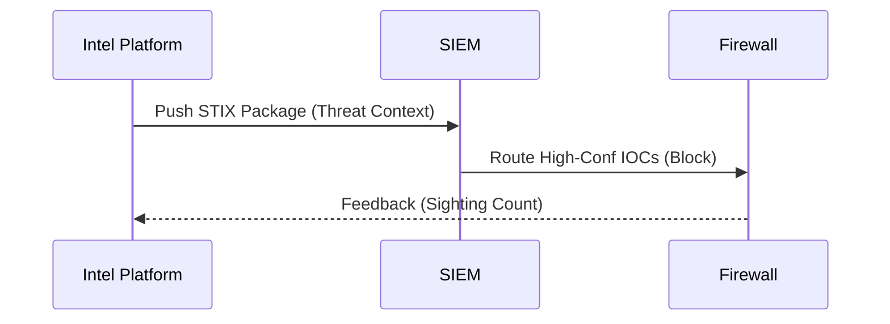

### File 7: `notes/07-sharing-stix-taxii.md`
*(Focus: Automation language)*

# 07 — Sharing Standards

## 🧠 Machine-to-Machine Flow
STIX is the package. TAXII is the truck.

## 🔑 Keywords

**STIX** (Structure), **TAXII** (Transport), **Automation**, **Interoperability**.

## 📝 Why use it?

You can't automate "an email PDF." You *can* automate a STIX JSON object.

* **Goal:** Zero-touch blocking for high-confidence commodity threats.

---

### ⚠️ Anti-Pattern → 🔧 The Fix

**Anti-Pattern:** Copy-pasting IPs from emails into the firewall.
**The Fix:** **Pipeline Integration**. Connect the TIP directly to the SIEM via TAXII.
**Evidence:** An automated feed that updates every 15 minutes without human intervention.
