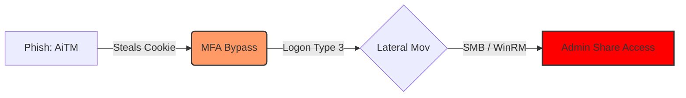

# 08 — Case Study: Phishing to Lateral Movement

## 🧠 The Attack Path
**Scenario:** User clicks link -> Attacker steals session token or credentials via AiTM -> Moves to Admin Share.



## 1. The Requirement (PIR)

* **Question:** Do we have visibility into lateral movement *after* a potential identity compromise?
* **Gap:** We see the login, but do we see the pivot?

## 2. Hypothesis & Mapping

* **Technique:** [T1021.002 (SMB/Windows Admin Shares)](https://attack.mitre.org/techniques/T1021/002/)
* **Logic:** If `User_A` logs in from `New_IP` AND immediately connects to `Server_B` via SMB, alert.

## 3. The Logic (Pseudo-Code)

*This demonstrates how I translated the Intel into a correlation rule (Sigma/SIEM agnostic):*

```sql
rule Detect_Lateral_Movement_After_Logon {
  meta:
    description = "Detects SMB connection shortly after a remote logon from the same user"
    severity = "High"
    author = "Pratik K."
  events:
    $logon = EventCode=4624 AND LogonType=3 // Network Logon
    $share = EventCode=5140 // Network Share Object Accessed (C$, ADMIN$)
  condition:
    $logon.TargetUser == $share.SubjectUser AND
    NOT in_subnets($logon.IpAddress, Trusted_Subnets) AND
    time_diff($logon.time, $share.time) < 5 minutes
}

```

Operational Assumptions & Constraints:

* **Data Quality:** Requires 4624 (LogonType 3) and 5140 events to be centrally collected. Clocks must be reasonably in sync for short-window correlation.

* **Context:** Trusted_Subnets represents known jump boxes, scanners, or management ranges where admin activity is expected.

* **Noise:** Expected false positives include SCCM/software deployment accounts, IT remote support, vulnerability scanners, backup agents, and routine admin-share access.

* **Velocity:** The 5-minute window is intentional. Pivots to SMB admin shares often happen quickly after remote access; tighter windows reduce background noise.

* **Caveat:** Event 5140 is often generated only once per session on the first access attempt. Treat this correlation as "best-effort" and validate against your specific environment's logging volume.

## 4. Reality Check (Tuning)

* **False Positive:** Initially, this triggered on the **SCCM Service Account** pushing patches (it behaves exactly like an attacker).
* **The Fix:** I added a whitelist for the specific `Trusted_Subnets` (IT Management VLAN) to reduce noise.
* **Result:** High-fidelity alerts only.

## 5. The Outcome

* **Validation:** Ran `Invoke-AtomicTest T1021.002` to simulate the traffic.
* **Result:** Detection logic triggered successfully in the test environment.
* **Metric:** Reduced detection time for pivoting from **4 hours** (manual log review) to **~10 minutes** (automated alert).

---

### ⚠️ Anti-Pattern → 🔧 The Fix

**Anti-Pattern:** Obsessing over the "Patient Zero" (the click) and ignoring the spread.
**The Fix:** **Assume Breach**. Build detections for the *next* step (Lateral Movement).
**Evidence:** Correlation rules linking Identity logs (Okta/Entra) with Endpoint logs (CrowdStrike/Sysmon).
