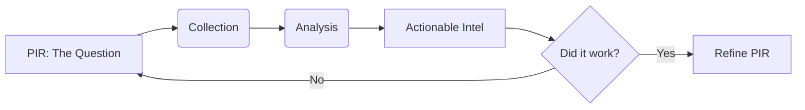

### File 1: `notes/01-lifecycle-and-pirs.md`

*(Focus: The feedback loop that prevents chaos)*


# 01 — Lifecycle + PIRs

## 🧠 The Mental Model
CTI is not a straight line; it's a loop. If "Action" doesn't create "Feedback," the loop is broken.



## 🔑 Keywords

**PIR** (Priority Intel Requirement), **RFI** (Request for Info), **Feedback Loop**, **Decision Support**.

## 📝 The PIR Template

Don't overcomplicate it. A good PIR fits on a post-it note.

* **Question:** What specific threat do we need to confirm?
* **Stakeholder:** Who asked? (e.g., CISO, SOC Lead).
* **Trigger:** Why now?
* **Expiry:** When does this answer become useless?
* **Success:** A new block rule, a patch, or a "risk accepted" memo.

---

### ⚠️ Anti-Pattern → 🔧 The Fix

**Anti-Pattern:** "Tell me everything about Ransomware." (Too broad, creates noise).
**The Fix:** "Do we have visibility into the specific exfiltration tool (Rclone) used by BlackCat?"
**Evidence:** A PIR list where every item has a specific "Decision Owner" attached.

```
